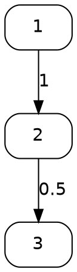

# SMILE — Graph User Guide

## Table of Contents

1. [Overview](#overview)
2. [Quick Start](#quick-start)
3. [Graph Representations](#graph-representations)
   - [AdjacencyList](#adjacencylist)
   - [AdjacencyMatrix](#adjacencymatrix)
   - [Choosing a Representation](#choosing-a-representation)
4. [Creating and Editing Graphs](#creating-and-editing-graphs)
   - [Constructors](#constructors)
   - [Adding Edges](#adding-edges)
   - [Removing Edges](#removing-edges)
   - [Querying Edges and Degrees](#querying-edges-and-degrees)
5. [Traversal](#traversal)
   - [Depth-First Search (DFS)](#depth-first-search-dfs)
   - [Breadth-First Search (BFS)](#breadth-first-search-bfs)
   - [VertexVisitor](#vertexvisitor)
6. [Connected Components](#connected-components)
7. [Topological Sort](#topological-sort)
8. [Shortest Paths — Dijkstra](#shortest-paths--dijkstra)
9. [Minimum Spanning Tree — Prim](#minimum-spanning-tree--prim)
10. [Maximum Flow — Push-Relabel](#maximum-flow--push-relabel)
11. [Travelling Salesman Problem (TSP)](#travelling-salesman-problem-tsp)
    - [Exact: Held-Karp](#exact-held-karp)
    - [Exact: Branch and Bound](#exact-branch-and-bound)
    - [Heuristic: Nearest Insertion](#heuristic-nearest-insertion)
    - [Heuristic: Farthest Insertion](#heuristic-farthest-insertion)
    - [Heuristic: Arbitrary Insertion](#heuristic-arbitrary-insertion)
    - [Heuristic: Christofides](#heuristic-christofides)
    - [Local Search: 2-opt](#local-search-2-opt)
    - [TSP Algorithm Comparison](#tsp-algorithm-comparison)
12. [Nearest Neighbor Graph](#nearest-neighbor-graph)
    - [Exact k-NN Graph](#exact-k-nn-graph)
    - [Approximate k-NN Graph: Random](#approximate-k-nn-graph-random)
    - [Approximate k-NN Graph: NN-Descent](#approximate-k-nn-graph-nn-descent)
    - [Largest Connected Component](#largest-connected-component)
13. [Matrix Conversion](#matrix-conversion)
14. [Graphviz Visualization](#graphviz-visualization)
15. [Mathematical Background](#mathematical-background)
16. [References](#references)

---

## Overview

The `smile.graph` package provides weighted directed and undirected graph
data structures together with a rich suite of graph algorithms:

| Class / Record | Role |
|---|---|
| `Graph` | Abstract base class; all algorithms live here |
| `AdjacencyList` | Sparse graph backed by `SparseArray[]` — preferred for most uses |
| `AdjacencyMatrix` | Dense graph backed by `double[][]` — best for small, dense graphs |
| `NearestNeighborGraph` | k-NN graph builder with exact and approximate methods |
| `VertexVisitor` | Functional interface for DFS / BFS callbacks |

**Algorithm summary:**

| Algorithm | Method | Complexity |
|---|---|---|
| DFS traversal | `dfs(VertexVisitor)` | O(V + E) |
| BFS traversal | `bfs(VertexVisitor)` | O(V + E) |
| DFS connected components | `dfcc()` | O(V + E) |
| BFS connected components | `bfcc()` | O(V + E) |
| DFS topological sort | `dfsort()` | O(V + E) |
| BFS topological sort (Kahn) | `bfsort()` | O(V + E) |
| Single-source shortest path | `dijkstra(s)` | O((V + E) log V) |
| All-pairs shortest path | `dijkstra()` | O(V(V + E) log V) |
| Minimum spanning tree/forest | `prim(mst)` | O(V²) |
| Maximum flow | `pushRelabel(flow, s, t)` | O(V² √E) |
| Optimal TSP (small) | `heldKarp()` | O(2ⁿ n²) |
| Optimal TSP (branch & bound) | `tsp()` | O(n!) worst case |
| TSP heuristics | `nearestInsertion()`, `farthestInsertion()`, `arbitraryInsertion()`, `christofides()` | O(n²) |
| TSP local improvement | `opt2(tour, maxIter)` | O(n²) per iteration |

---

## Quick Start

```java
import smile.graph.*;
import java.util.ArrayList;
import java.util.List;

// --- Undirected weighted graph ---
Graph g = new AdjacencyList(6);
g.addEdge(0, 1, 0.41);
g.addEdge(1, 2, 0.51);
g.addEdge(2, 3, 0.50);
g.addEdge(0, 5, 0.29);
g.addEdge(5, 4, 0.21);
g.addEdge(1, 4, 0.32);
g.addEdge(4, 2, 0.32);
g.addEdge(5, 1, 0.29);
g.addEdge(4, 3, 0.36);
g.addEdge(3, 5, 0.38);
g.addEdge(3, 0, 0.45);

// Shortest paths from vertex 0
double[] dist = g.dijkstra(0);
System.out.printf("0 → 3 = %.2f%n", dist[3]);  // 0.86

// Minimum spanning tree
List<Graph.Edge> mst = new ArrayList<>();
double cost = g.prim(mst);
System.out.printf("MST cost = %.2f%n", cost);   // 1.47

// Optimal TSP tour (Held-Karp, exact)
int[] tour = g.heldKarp();
System.out.printf("TSP cost = %.2f%n", g.getPathDistance(tour)); // 2.17
```

---

## Graph Representations

### AdjacencyList

```java
AdjacencyList g = new AdjacencyList(n);            // undirected
AdjacencyList g = new AdjacencyList(n, true);      // directed (digraph)
```

Backed by a `SparseArray[]` — one sparse array per vertex. Each sparse array
stores `(neighbor, weight)` pairs for that vertex's outgoing edges.

| Property | Value |
|---|---|
| Memory | O(V + E) |
| `hasEdge(u, v)` | O(degree(u)) |
| `getWeight(u, v)` | O(degree(u)) |
| `setWeight(u, v, w)` | O(degree(u)) amortized |
| `getOutDegree(v)` | O(1) |
| `getInDegree(v)` | O(V) — scans all rows |
| Serializable | Yes (`serialVersionUID = 3`) |

**Construction from a sparse matrix:**

```java
SparseMatrix mat = /* ... */;
AdjacencyList g = AdjacencyList.of(mat);
// Symmetric matrix → undirected graph
// Asymmetric or rectangular matrix → bipartite graph (nrow + ncol vertices)
```

### AdjacencyMatrix

```java
AdjacencyMatrix g = new AdjacencyMatrix(n);           // undirected
AdjacencyMatrix g = new AdjacencyMatrix(n, true);     // directed
```

Backed by a `double[n][n]` array. Entry `graph[i][j]` holds the weight of
edge `i → j` (0.0 means no edge).

| Property | Value |
|---|---|
| Memory | O(V²) |
| `hasEdge(u, v)` | O(1) |
| `getWeight(u, v)` | O(1) |
| `setWeight(u, v, w)` | O(1) |
| `getOutDegree(v)` | O(V) |
| `getInDegree(v)` | O(V) |
| `pushRelabel()` available | Yes (only on `AdjacencyMatrix`) |
| Serializable | Yes (`serialVersionUID = 2`) |

**Additional matrix methods:**

```java
double[][] arr = ((AdjacencyMatrix) g).toArray(); // defensive copy of the weight matrix
```

### Choosing a Representation

| Criterion | Use `AdjacencyList` | Use `AdjacencyMatrix` |
|---|---|---|
| Graph density | Sparse (E ≪ V²) | Dense (E ≈ V²) |
| Vertex count | Any | Small–medium (≤ ~10 000) |
| Need max-flow | No | Yes (`pushRelabel`) |
| Frequent `getWeight` | Not critical | Critical (O(1)) |
| Memory budget | Constrained | Generous |
| Default choice | **Yes** | Only when dense or max-flow needed |

---

## Creating and Editing Graphs

### Constructors

```java
// n vertices, undirected
Graph g = new AdjacencyList(5);
Graph g = new AdjacencyMatrix(5);

// n vertices, directed
Graph g = new AdjacencyList(5, true);
Graph g = new AdjacencyMatrix(5, true);
```

The `isDigraph()` method returns whether the graph is directed:

```java
g.isDigraph(); // true / false
```

### Adding Edges

```java
// Unweighted (weight = 1.0)
g.addEdge(source, target);

// Weighted
g.addEdge(source, target, 2.5);

// Bulk add from a collection
List<Graph.Edge> edges = List.of(
    new Graph.Edge(0, 1, 1.0),
    new Graph.Edge(1, 2, 2.0)
);
g.addEdges(edges);
```

For **undirected** graphs, `addEdge(u, v, w)` automatically sets both
`graph[u][v]` and `graph[v][u]` to `w`. For **directed** graphs, only
`graph[u][v]` is set.

`setWeight(source, target, weight)` is the primitive underlying `addEdge`.
Setting weight to `0.0` removes the edge (equivalent to `removeEdge`).

### Removing Edges

```java
// Remove a single edge
g.removeEdge(source, target);

// Bulk remove
g.removeEdges(edgeCollection);
```

Removal sets the edge weight to `0.0`. For undirected graphs, both directions
are zeroed.

### Querying Edges and Degrees

```java
g.hasEdge(u, v);            // true if edge exists
g.getWeight(u, v);          // weight, or 0.0 if absent
g.getDistance(u, v);        // weight, or +Infinity if absent — use for TSP/shortest-path

g.getDegree(v);             // undirected: out-degree; directed: in + out
g.getInDegree(v);           // number of incoming edges
g.getOutDegree(v);          // number of outgoing edges

List<Graph.Edge> edges = g.getEdges(v);   // all edges from v
g.getVertexCount();                        // number of vertices
```

**Functional edge operations:**

```java
// Sum all weights from vertex 0
double total = g.mapEdges(0, (neighbor, w) -> w).sum();

// Scale all weights from vertex 0 by 2
g.updateEdges(0, (neighbor, w) -> w * 2.0);

// Accumulate with a side effect
double[] sum = {0.0};
g.forEachEdge(0, (neighbor, w) -> sum[0] += w);
```

**The `Graph.Edge` record:**

```java
record Edge(int u, int v, double weight)
```

- `u()` — source (tail for directed)
- `v()` — target (head for directed)
- `weight()` — edge weight (`1.0` for unweighted)
- `compareTo(Edge)` — orders by weight (natural order for priority queues)
- Unweighted constructor: `new Graph.Edge(u, v)` sets `weight = 1.0`

---

## Traversal

### Depth-First Search (DFS)

`dfs(VertexVisitor)` visits all vertices reachable from each unvisited root,
performing a recursive post-order style traversal. The entire graph is covered,
including disconnected components.

```java
List<Integer> order = new ArrayList<>();
g.dfs(order::add);
// order contains all vertices in DFS visit order
```

### Breadth-First Search (BFS)

`bfs(VertexVisitor)` visits vertices in level-order (shortest hop-count from
each component root first).

```java
List<Integer> order = new ArrayList<>();
g.bfs(order::add);
```

### VertexVisitor

`VertexVisitor` is a `@FunctionalInterface` with a single method:

```java
void accept(int vertex);
```

Any lambda or method reference accepting an `int` can be used:

```java
g.dfs(v -> System.out.println("Visiting " + v));
g.bfs(results::add);
```

---

## Connected Components

Two algorithms are provided; both return a `int[][]` where each row is a
sorted array of vertex indices belonging to the same component.

```java
// DFS-based (recursive — may StackOverflow on very large graphs)
int[][] cc = g.dfcc();

// BFS-based (iterative — safe for large graphs)
int[][] cc = g.bfcc();
```

Both methods require an **undirected** graph; calling them on a digraph throws
`UnsupportedOperationException`.

```java
int[][] cc = g.bfcc();
System.out.printf("%d components%n", cc.length);
for (int[] component : cc) {
    System.out.println(Arrays.toString(component));
}
```

**Single vertex:**

A graph with no edges produces one component per vertex:

```java
AdjacencyList g = new AdjacencyList(4); // no edges
int[][] cc = g.bfcc();
// cc.length == 4, each cc[i] == {i}
```

---

## Topological Sort

Topological sort is only defined for **directed** graphs (digraphs). Calling
these on an undirected graph throws `UnsupportedOperationException`.

```java
// DFS-based reverse post-order (standard topological sort)
int[] order = g.dfsort();

// BFS-based (Kahn's algorithm)
int[] order = g.bfsort();
```

`bfsort()` returns `-1` for vertices that are not reachable in topological
order (i.e., those involved in a cycle). `dfsort()` always produces a
complete ordering.

```java
Graph dag = new AdjacencyList(13, true);
dag.addEdge(0, 1); dag.addEdge(0, 5); dag.addEdge(0, 6);
dag.addEdge(2, 0); dag.addEdge(2, 3); dag.addEdge(3, 5);
// ...

int[] topo = dag.bfsort();
// Process vertices in topological order
for (int v : topo) {
    if (v >= 0) process(v);
}
```

---

## Shortest Paths — Dijkstra

Dijkstra's algorithm computes shortest paths on non-negative weighted graphs.

```java
// Single-source (weighted)
double[] dist = g.dijkstra(source);
// dist[v] = shortest distance from source to v, or +Infinity if unreachable

// Single-source (unweighted = hop count)
double[] hops = g.dijkstra(source, false);

// All-pairs (calls dijkstra(i) for every vertex i)
double[][] allPairs = g.dijkstra();
```

```java
Graph g = new AdjacencyList(6, true);
g.addEdge(0, 1, 0.41);
g.addEdge(0, 5, 0.29);
g.addEdge(5, 4, 0.21);
g.addEdge(5, 1, 0.29);
g.addEdge(1, 4, 0.32);
g.addEdge(1, 2, 0.51);
g.addEdge(4, 2, 0.32);
g.addEdge(4, 3, 0.36);
g.addEdge(2, 3, 0.50);
g.addEdge(3, 5, 0.38);
g.addEdge(3, 0, 0.45);

double[] d = g.dijkstra(0);
// d[0]=0.00, d[1]=0.41, d[2]=0.82, d[3]=0.86, d[4]=0.50, d[5]=0.29
```

> **Note:** Dijkstra does not handle negative edge weights. Use Bellman-Ford
> for graphs with negative edges.

---

## Minimum Spanning Tree — Prim

Prim's algorithm finds the **minimum spanning tree** (MST) of a weighted
undirected graph. For disconnected graphs it returns the **minimum spanning
forest** (one tree per component). Calling on a digraph throws
`UnsupportedOperationException`.

```java
List<Graph.Edge> mst = new ArrayList<>();
double totalCost = g.prim(mst);
// mst contains the n-1 edges of the spanning tree (or forest)
// totalCost is the sum of their weights
```

Pass `null` instead of a list if you only need the total cost:

```java
double cost = g.prim(null);
```

```java
Graph g = new AdjacencyList(6);
// ... add edges ...
List<Graph.Edge> mst = new ArrayList<>();
double cost = g.prim(mst);
System.out.printf("MST cost = %.2f, edges = %d%n", cost, mst.size());
for (var e : mst) {
    System.out.printf("  %d -- %d  (%.2f)%n", e.u(), e.v(), e.weight());
}
```

> **Complexity:** O(V²) — suitable for dense graphs. For very sparse graphs
> a priority-queue version would be O((V + E) log V), but Prim's current
> implementation uses a simple scan.

---

## Maximum Flow — Push-Relabel

Maximum flow is available **only on `AdjacencyMatrix`** via the
push-relabel (highest-label) algorithm.

```java
AdjacencyMatrix g = new AdjacencyMatrix(n, true);
g.addEdge(source, sink,   capacity);
// ... add capacity edges ...

double[][] flow = new double[n][n]; // output: flow on each edge
double maxFlow = g.pushRelabel(flow, source, sink);
```

`flow[u][v]` contains the net flow on arc `u → v` after the call; negative
values on the reverse arc represent the return flow. The method returns the
total maximum flow value.

```java
AdjacencyMatrix g = new AdjacencyMatrix(6, true);
g.addEdge(0, 1, 2);
g.addEdge(0, 2, 9);
g.addEdge(1, 2, 1);
g.addEdge(2, 4, 7);
g.addEdge(4, 5, 4);
g.addEdge(3, 5, 7);

double[][] flow = new double[6][6];
double maxFlow = g.pushRelabel(flow, 0, 5); // maxFlow == 4.0
```

> **Complexity:** O(V² √E) — the highest-label push-relabel variant.

---

## Travelling Salesman Problem (TSP)

The graph package provides both **exact** and **heuristic** TSP solvers, plus
a 2-opt local improvement pass. All TSP methods return an `int[]` tour of
length `n + 1` where `tour[0] == tour[n] == 0` (the route starts and ends at
vertex 0).

Use `getPathDistance(tour)` to evaluate tour cost:

```java
int[] tour = g.heldKarp();
double cost = g.getPathDistance(tour);
```

### Exact: Held-Karp

Dynamic-programming exact TSP solver. Optimal for graphs up to **31 vertices**.

```java
int[] tour = g.heldKarp(); // O(2ⁿ n²) — feasible up to n ≈ 20–25
```

- Memory: O(2ⁿ n)
- Guaranteed optimal
- Throws `UnsupportedOperationException` if `n > 31`

### Exact: Branch and Bound

Branch-and-bound exact solver seeded with the nearest-insertion heuristic.

```java
int[] tour = g.tsp(); // best-first search with MST lower bound pruning
```

- Optimal in theory; practical for n up to ~15–20 depending on graph density
- Uses MST lower bound when more than 5 vertices remain in the subproblem
- Logs the final tour cost at `INFO` level via SLF4J

### Heuristic: Nearest Insertion

Builds the tour by repeatedly inserting the **nearest** unvisited city.

```java
int[] tour = g.nearestInsertion(); // O(n²)
```

Typically gives tours within 20–25% of optimal on random instances.

### Heuristic: Farthest Insertion

Builds the tour by repeatedly inserting the **farthest** unvisited city.

```java
int[] tour = g.farthestInsertion(); // O(n²)
```

Often produces better tours than nearest insertion on structured instances.

### Heuristic: Arbitrary Insertion

Inserts cities in their natural index order (1, 2, 3, …), choosing the
cheapest insertion position each time.

```java
int[] tour = g.arbitraryInsertion(); // O(n²)
```

### Heuristic: Christofides

A classical 3/2-approximation algorithm for metric TSP instances:

1. Compute a minimum spanning tree (Prim).
2. Find odd-degree vertices in the MST.
3. Apply greedy minimum-weight perfect matching on odd-degree vertices.
4. Form a multigraph from MST + matching; find an Eulerian circuit.
5. Shortcut the Eulerian circuit to a Hamiltonian path.

```java
int[] tour = g.christofides(); // O(n²); guaranteed ≤ 1.5× OPT on metric instances
```

### Local Search: 2-opt

Improves any existing tour by repeatedly swapping pairs of non-adjacent edges
whenever the swap reduces total cost.

```java
// Start from a heuristic tour
int[] tour = g.nearestInsertion();

// Improve with 2-opt (up to 10 outer iterations)
double cost = g.opt2(tour, 10);
// tour[] is modified in-place; cost is the new tour length
```

`opt2` throws `IllegalArgumentException` if `tour.length != n + 1`.

### TSP Algorithm Comparison

| Algorithm | Type | Optimal? | Practical n | Notes |
|---|---|---|---|---|
| `heldKarp()` | Exact DP | Yes | ≤ 25 | O(2ⁿ n²), memory O(2ⁿ n) |
| `tsp()` | Exact B&B | Yes | ≤ 20 | MST pruning; seeded with `nearestInsertion` |
| `nearestInsertion()` | Heuristic | No | Any | Fast; ≈ 20% above OPT |
| `farthestInsertion()` | Heuristic | No | Any | Often better than nearest |
| `arbitraryInsertion()` | Heuristic | No | Any | Simplest; insertion order = 1,2,… |
| `christofides()` | Heuristic | No | Any | ≤ 1.5× OPT on metric graphs |
| `opt2(tour, k)` | Local search | No | Any | Post-process any tour |

**Recommended workflow for large instances:**

```java
// 1. Get a good starting tour
int[] tour = g.farthestInsertion();
// 2. Improve locally
double cost = g.opt2(tour, 100);
System.out.printf("Tour cost after 2-opt: %.4f%n", cost);
```

---

## Nearest Neighbor Graph

`NearestNeighborGraph` is a `record` that builds and stores k-nearest neighbor
graphs for datasets, returning an `AdjacencyList` for downstream graph
algorithms.

```java
record NearestNeighborGraph(int k, int[][] neighbors, double[][] distances, int[] index)
```

- `neighbors[i][j]` — index of the j-th nearest neighbor of point i
- `distances[i][j]` — distance from point i to its j-th nearest neighbor
- `index` — original dataset indices (useful when working with a subset)
- `size()` — number of vertices (same as `neighbors.length`)

The canonical constructor validates all fields: `k ≥ 1`, non-null arrays,
and consistent lengths between `neighbors`, `distances`, and `index`.
`k` must be ≥ 2 for all factory methods (`of`, `random`, `descent`).

### Exact k-NN Graph

Computes the exact k nearest neighbors using a brute-force pairwise scan.

```java
// Euclidean distance (double[][] data)
NearestNeighborGraph knn = NearestNeighborGraph.of(data, k);

// Custom distance
NearestNeighborGraph knn = NearestNeighborGraph.of(data, MyDistance::d, k);
```

`k` must be ≥ 2. Complexity: O(n² · d) for n points in d dimensions.

### Approximate k-NN Graph: Random

Builds a k-random-neighbor graph and extends it with reverse neighbors.
Faster than exact but less accurate; useful as initialization for NN-Descent.

```java
NearestNeighborGraph approx = NearestNeighborGraph.random(data, MathEx::distance, k);
```

### Approximate k-NN Graph: NN-Descent

The **NN-Descent** algorithm iteratively refines an approximate k-NN graph.
The intuition: "a neighbor of my neighbor is also likely my neighbor."

```java
// With Euclidean distance and random projection forest initialization
NearestNeighborGraph knn = NearestNeighborGraph.descent(data, k);

// With custom metric (no forest initialization)
NearestNeighborGraph knn = NearestNeighborGraph.descent(data, distance, k);

// Full control
NearestNeighborGraph knn = NearestNeighborGraph.descent(
    data, k,
    numTrees,       // number of random projection trees for seeding
    leafSize,       // max leaf size in each tree
    maxCandidates,  // max candidates per iteration
    maxIter,        // max NN-Descent iterations
    delta           // convergence threshold (fraction of k*n updates)
);
```

NN-Descent achieves near-exact quality with O(n^1.14) empirical complexity
on many real datasets (vs O(n²) for brute force).

**Algorithm parameters:**

| Parameter | Default | Effect |
|---|---|---|
| `numTrees` | 5 | More trees → better initialization → faster convergence |
| `leafSize` | k | Larger leaves → more initial candidates |
| `maxCandidates` | 50 | More candidates per iteration → higher quality, slower |
| `maxIter` | 50 | More iterations → higher quality, slower |
| `delta` | 0.001 | Smaller → more iterations; larger → early stop |

### Largest Connected Component

Returns a new `NearestNeighborGraph` restricted to the vertices of the largest
connected component, with neighbor indices remapped into the subgraph's local
coordinate space (`[0, largest.size())`).

```java
NearestNeighborGraph knn = NearestNeighborGraph.descent(data, k);
NearestNeighborGraph largest = knn.largest(false); // false = undirected
```

- If the graph is already fully connected, the **same object** is returned
  (`assertSame` holds).
- The returned graph has `index.length` vertices (not the original `n`),
  so `largest.size() ≤ knn.size()`.
- `largest.index()[i]` gives the original dataset index for vertex `i` in
  the filtered subgraph.
- All neighbor indices in the result are in the range `[0, largest.size())`.
- Logs the number of components and the size of the largest at `INFO` level.

### Converting to AdjacencyList

```java
NearestNeighborGraph knn = NearestNeighborGraph.of(data, k);

AdjacencyList undirected = knn.graph(false); // undirected (mutual edges)
AdjacencyList directed   = knn.graph(true);  // directed (only i → neighbor[i][j])
```

**Full pipeline example:**

```java
import smile.graph.*;
import smile.math.MathEx;

double[][] data = /* n × d dataset */;

// Build approximate 7-NN graph
NearestNeighborGraph knn = NearestNeighborGraph.descent(data, 7);

// Keep only the largest connected component
NearestNeighborGraph largest = knn.largest(false);
System.out.printf("Keeping %d / %d points%n", largest.size(), data.length);

// Convert to AdjacencyList for further analysis
AdjacencyList graph = largest.graph(false);

// Compute connected components (should be 1)
int[][] cc = graph.bfcc();
System.out.println("Components: " + cc.length);
```

---

## Matrix Conversion

Both graph implementations can be converted to their matrix form:

```java
// AdjacencyList → SparseMatrix
SparseMatrix m = ((AdjacencyList) g).toMatrix();

// AdjacencyMatrix → DenseMatrix
Matrix m = ((AdjacencyMatrix) g).toMatrix();

// AdjacencyMatrix → raw double[][]  (defensive copy)
double[][] arr = ((AdjacencyMatrix) g).toArray();
```

Conversion from a sparse matrix back to a graph:

```java
// Symmetric → undirected; asymmetric/rectangular → bipartite (nrow+ncol vertices)
AdjacencyList g = AdjacencyList.of(sparseMatrix);
```

**Subgraph extraction:**

```java
int[] vertices = {1, 3, 7};
Graph sub = g.subgraph(vertices);
// sub has vertices.length vertices, with indices 0, 1, 2, …
// mapped to vertices[0], vertices[1], vertices[2], … in the original graph
```

---

## Graphviz Visualization

Both graph types support export to [Graphviz](https://graphviz.org/) DOT format.
Paste the output at https://viz-js.com/ to render the graph.

```java
// Simple DOT output
String dot = g.dot();

// With graph name and vertex labels
String[] labels = {"Alice", "Bob", "Carol", "Dave"};
String dot = g.dot("Friends", labels);

System.out.println(dot);
```

Example output for a directed graph:



Edge labels display the weight. For unweighted edges the label is `"1"`.
The `Strings.format()` utility is used for compact floating-point formatting.

---

## Mathematical Background

### Graph Definitions

A **graph** G = (V, E) consists of a vertex set V and an edge set E ⊆ V × V.

- **Directed graph (digraph):** edges are ordered pairs (u, v); only
  `u → v` exists, not necessarily `v → u`.
- **Undirected graph:** edges are unordered pairs {u, v}; both directions
  are stored symmetrically.
- **Weighted graph:** each edge carries a numerical weight `w(u, v) > 0`.
- **Simple graph:** no self-loops, no multi-edges.

### Dijkstra's Algorithm

For a graph with non-negative weights, Dijkstra maintains a priority queue of
tentative distances and relaxes edges greedily:

```
dist[s] = 0; dist[v] = ∞ for all v ≠ s
while queue not empty:
    u = vertex with minimum dist[u]
    for each neighbor v of u:
        if dist[u] + w(u,v) < dist[v]:
            dist[v] = dist[u] + w(u,v)
```

### Prim's MST Algorithm

Prim grows the MST from vertex 0 by always adding the cheapest edge that
connects a tree vertex to a non-tree vertex:

```
inMST[0] = true; minEdge[0] = 0; minEdge[v] = ∞ for v ≠ 0
repeat n times:
    u = non-tree vertex with minimum minEdge[u]
    add u to MST; totalCost += minEdge[u]
    for each neighbor v of u: minEdge[v] = min(minEdge[v], w(u,v))
```

For disconnected graphs, when no reachable non-tree vertex exists the
algorithm seeds the next unvisited vertex, producing a **minimum spanning
forest**.

### Held-Karp TSP

Held-Karp uses bitmask dynamic programming. `dp[S][v]` = minimum cost to
visit exactly the vertices in set S, ending at vertex v, starting from 0:

```
dp[{0}][0] = 0
dp[S][v] = min over u in S\{v} of: dp[S\{v}][u] + dist(u, v)
OPT = min over v ≠ 0 of: dp[{all}][v] + dist(v, 0)
```

Memory: O(2ⁿ × n); time: O(2ⁿ × n²). Feasible for n ≤ 25.

### NN-Descent

NN-Descent exploits the transitivity of nearest-neighbor relations: if j is
close to i, and k is close to j, then k may also be close to i. Each
iteration evaluates "neighbor-of-neighbor" candidate pairs and updates the
k-NN heaps, stopping when the fraction of updates falls below `delta × k × n`.

---

## References

1. Robert Sedgewick and Kevin Wayne. *Algorithms, 4th Edition.* Addison-Wesley, 2011.

2. Thomas H. Cormen, Charles E. Leiserson, Ronald L. Rivest, and Clifford Stein.
   *Introduction to Algorithms, 3rd Edition.* MIT Press, 2009.

3. Held, M. and Karp, R. M. *A dynamic programming approach to sequencing
   problems.* Journal of the Society for Industrial and Applied Mathematics,
   10(1):196–210, 1962.

4. Wei Dong, Charikar Moses, and Kai Li. *Efficient k-nearest neighbor graph
   construction for generic similarity measures.* Proceedings of the 20th
   International Conference on World Wide Web (WWW), 2011.

5. Andrew V. Goldberg and Robert E. Tarjan. *A new approach to the maximum-flow
   problem.* Journal of the ACM, 35(4):921–940, 1988.

6. Nicos Christofides. *Worst-case analysis of a new heuristic for the
   travelling salesman problem.* Technical Report, Carnegie Mellon University, 1976.


---

*SMILE — © 2010-2026 Haifeng Li. GNU GPL licensed.*

